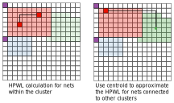

# Detailed Placement
In `cgra_pnr`, the term "detailed placement" is slightly different from the
same term used in ASIC/FPGA placement. Here it refers to placement within a
cluster. Currently it's implemented as a simulated annealing placer.

The figure below shows how detailed placement works with clusters.

