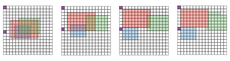

# Global Placement
In `cgra_pnr`, there are several different global placers been implemented,
e.g., slice-based global placer, simulated annealing (SA) based placer, and
analytical placer. The current `master`, SHA `9032d87`, uses a combination of
analytical and SA placer. Please notice that the placable unit in the global
placer is a cluster, which is equivalent to the computational kernel. There
are several ways to compute the kernel and you'll find different
implementations in different branch, as it's still work in progress.

## Slice Placer
The chip is divided into slices and the basic unit is a single slice. In the
implementation the slice is called Macroblock, a term derived from video
compression.

Slice-based placer is able to function very well even if the area utilization
is high. However, it is much slower than the analytical placer.

## Simulated Annealing Placer
It performs three possible movements when perform annealing:
1. Move clusters up to `<dx, dy>`, where `dx` and `dy` are random numbers with
certain range.
2. Swap two clusters locations.
3. Change the cluster's shape

Each movement has to be legal before committing the changes. Currently it takes
a long to converge to a good solution (Python is very slow.)

## Analytical Placer
This placer tries to minimize the cost function, which is a combination of
HPWL, legal energy, and overlapping energy. See the figure below for better
visualization.

